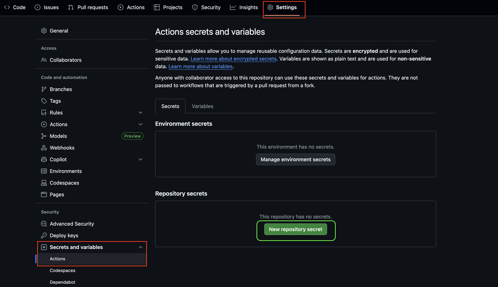
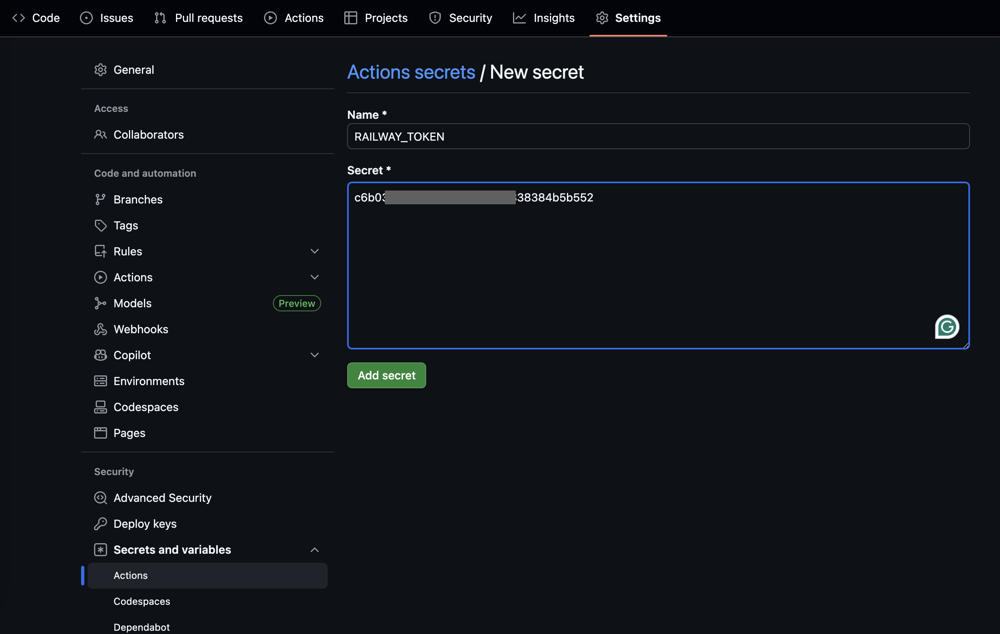

# 🔐 GitHub Secrets Configuration Guide

> **Essential guide for setting up secrets in GitHub Actions for secure CI/CD deployment**

## 📋 Table of Contents

- [🎯 Overview](#-overview)
- [🔑 Required Secrets for JavaScript App](#-required-secrets-for-javascript-app)
- [📖 Step-by-Step Setup Guide](#-step-by-step-setup-guide)
- [🚂 How to Get Your RAILWAY_TOKEN](#-how-to-get-your-railway_token)
- [🔒 Security Best Practices](#-security-best-practices)
- [🔧 Troubleshooting](#-troubleshooting)
- [✅ Verification](#-verification)

---

## 🎯 Overview

GitHub Secrets allow you to store sensitive information like API keys, tokens, and passwords securely in your repository. These secrets are encrypted and only accessible to your GitHub Actions workflows during execution.

**Why Use Secrets?**
- ✅ Keep sensitive data out of your code
- ✅ Encrypted and secure storage
- ✅ Only accessible during workflow execution
- ✅ Easy to update without changing code

---

## 🔑 Required Secrets for JavaScript App

For the JavaScript application CI/CD pipeline, you need:

| Secret Name | Purpose | Where to Get It |
|-------------|---------|-----------------|
| `RAILWAY_TOKEN` | Deploy to Railway platform | Railway Dashboard |

---

## 📖 Step-by-Step Setup Guide

### Step 1: Navigate to Repository Settings

1. **Open your GitHub repository** in a web browser
2. **Click the "Settings" tab** (located at the top-right of the repository page)
3. **In the left sidebar**, scroll down and click **"Secrets and variables"**
4. **Select "Actions"** from the dropdown menu



### Step 2: Add New Repository Secret

1. **Click the "New repository secret" button** (green button on the right)
2. **Enter the secret name** exactly as specified (case-sensitive!)
3. **Enter the secret value** (your actual token/password)
4. **Click "Add secret"** to save



### Step 3: Repeat for All Required Secrets

Complete Step 2 for each secret listed in the [Required Secrets](#-required-secrets-for-javascript-app) section.

---

## 🚂 How to Get Your RAILWAY_TOKEN

### Through Railway Dashboard (Recommended)

1. **Login to Railway**
   - Go to [railway.app](https://railway.app)
   - Sign in with your account

2. **Access Account Settings**
   - Click on your **profile picture** (top-right corner)
   - Select **"Account Settings"** from the dropdown

3. **Navigate to Tokens Section**
   - In the left sidebar, click **"Tokens"**
   - You'll see the API tokens management page

4. **Create New Token**
   - Click **"Create Token"** button
   - Give it a descriptive name (e.g., "GitHub Actions CI/CD")
   - **Copy the generated token immediately** (you won't see it again!)

5. **Add to GitHub Secrets**
   - Go back to your GitHub repository settings
   - Add a new secret with:
     - **Name**: `RAILWAY_TOKEN`
     - **Value**: The token you just copied

---

## 🔒 Security Best Practices

### ✅ Do's

- **Use descriptive names** for your tokens (e.g., "GitHub Actions Deployment")
- **Set expiration dates** when possible
- **Regularly rotate tokens** (every 3-6 months)
- **Use the principle of least privilege** (minimal required permissions)
- **Keep secrets at the repository level** unless needed organization-wide

### ❌ Don'ts

- **Never commit secrets to your code** (even in comments)
- **Don't share secrets** in chat or email
- **Don't use the same token** across multiple projects
- **Don't ignore security warnings** from GitHub
- **Don't use secrets in pull request workflows** from forks

### 🔍 Secret Naming Conventions

Follow these patterns for consistency:

```
PLATFORM_PURPOSE
```

Examples:
- `RAILWAY_TOKEN` (not `railway_token` or `Railway-Token`)
- `DOCKER_USERNAME` (not `dockerUsername`)
- `API_KEY` (not `api-key`)

---

## 🔧 Troubleshooting

### Common Issues and Solutions

#### ❌ "Authentication failed" during deployment

**Possible Causes:**
- Invalid or expired token
- Incorrect secret name (case-sensitive!)
- Token doesn't have required permissions

**Solutions:**
1. **Verify secret name** matches exactly: `RAILWAY_TOKEN`
2. **Regenerate token** in Railway dashboard
3. **Update secret value** in GitHub with new token
4. **Check token permissions** in Railway

#### ❌ "Secret not found" error in workflow

**Possible Causes:**
- Typo in secret name in workflow file
- Secret not created in repository settings
- Using organization secret instead of repository secret

**Solutions:**
1. **Check workflow YAML** for correct secret reference:
   ```yaml
   env:
     RAILWAY_TOKEN: ${{ secrets.RAILWAY_TOKEN }}
   ```
2. **Verify secret exists** in repository settings
3. **Ensure correct scope** (repository vs organization)

#### ❌ Railway CLI installation fails

**Possible Causes:**
- Node.js not properly set up in workflow
- Network issues during npm install

**Solutions:**
1. **Ensure Node.js setup** in workflow:
   ```yaml
   - uses: actions/setup-node@v4
     with:
       node-version: '18'
   ```
2. **Use specific Railway CLI version**:
   ```yaml
   - run: npm install -g @railway/cli@latest
   ```

#### ❌ "railway up" command hangs

**Possible Causes:**
- Interactive prompts waiting for input
- Large deployment taking time

**Solutions:**
1. **Use non-interactive flags**:
   ```bash
   railway up --detach
   ```
2. **Add timeout to workflow step**:
   ```yaml
   - name: Deploy to Railway
     timeout-minutes: 10
     run: railway up --detach
   ```

---

## ✅ Verification

### Verify Your Setup

1. **Check Secret Creation**
   - Go to repository Settings → Secrets and variables → Actions
   - Confirm `RAILWAY_TOKEN` appears in the list
   - You should see "Updated X minutes ago"

2. **Test Secret Access in Workflow**
   Add this temporary step to your workflow for testing:
   ```yaml
   - name: Test secret access
     run: |
       if [ -z "${{ secrets.RAILWAY_TOKEN }}" ]; then
         echo "❌ RAILWAY_TOKEN not found"
         exit 1
       else
         echo "✅ RAILWAY_TOKEN is accessible"
       fi
   ```

3. **Run a Test Deployment**
   - Push a small change to trigger the workflow
   - Monitor the Actions tab for successful execution
   - Check Railway dashboard for successful deployment

### Security Audit Checklist

- [ ] All secrets use strong, unique values
- [ ] Secret names follow naming conventions
- [ ] No secrets are committed to code
- [ ] Tokens have appropriate expiration dates
- [ ] Only necessary people have repository admin access
- [ ] Regular token rotation schedule is established

---

## 📚 Additional Resources

- [GitHub Actions Secrets Documentation](https://docs.github.com/en/actions/security-guides/encrypted-secrets)
- [Railway CLI Documentation](https://docs.railway.app/develop/cli)
- [Railway API Tokens Guide](https://docs.railway.app/reference/api-reference)
- [CI/CD Security Best Practices](https://docs.github.com/en/actions/security-guides)

---

## 🆘 Need Help?

If you encounter issues not covered in this guide:

1. **Check the workflow logs** in the Actions tab
2. **Review Railway deployment logs** in the Railway dashboard
3. **Consult the course documentation** or ask your instructor
4. **Verify all prerequisites** are met (Railway account, proper permissions)

---

**Happy Deploying! 🚀**

> Remember: Security is everyone's responsibility. Keep your secrets safe and follow best practices!
